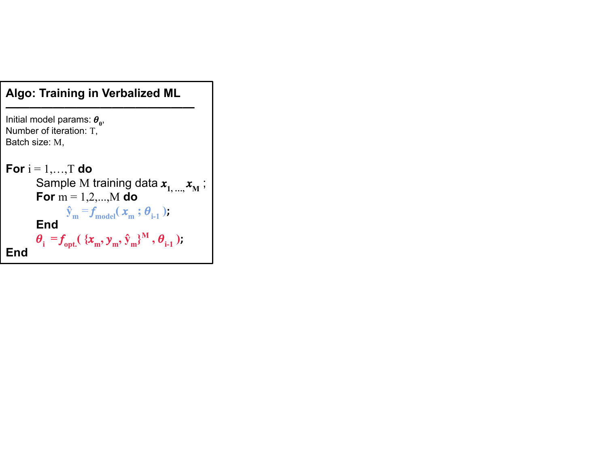

# Verbalized Machine Learning -- Examples


<div align="center">

  [](https://arxiv.org/abs/2406.04344)
  [](https://opensource.org/licenses/MIT)
  [](https://colab.research.google.com/drive/1QFCt_DFM65szsWUSEPRnuEoLwzjDxUth?usp=sharing)

</div>


<br>


## News
- [2025/03/16] <a href='https://colab.research.google.com/drive/1QFCt_DFM65szsWUSEPRnuEoLwzjDxUth?usp=sharing' style='padding-left: 0.5rem;'></a> We created a Google Colab demo  for a quick hands-on for VML.
- [2025/01/26] VML got accepted by [TMLR](https://openreview.net/forum?id=k3Ab6RuJE9)!


## Introduction

This repository provides toy examples demonstrating the concept of _Verbalized Machine Learning (VML)_ introduced by the paper:

**Verbalized Machine Learning: Revisiting Machine Learning with Language Models**  
Tim Z. Xiao, Robert Bamler, Bernhard Schölkopf, Weiyang Liu  
Paper: https://arxiv.org/abs/2406.04344



VML introduces a new framework of machine learning.
Unlike conventional machine learning models that are typically optimized over a continuous parameter space, VML constrains the parameter space to be human-interpretable natural language. 
Such a constraint leads to a new perspective of function approximation, where an LLM with a text prompt can be viewed as a function parameterized by the text prompt.

Many classical machine learning problems can be solved under this new framework using an LLM-parameterized learner and optimizer. 
The major advantages of VML include:
1. Easy encoding of inductive bias: prior knowledge about the problem and hypothesis class can be encoded in natural language and fed into the LLM-parameterized learner. 
2. Automatic model class selection: the optimizer can automatically select a concrete model class based on data and verbalized prior knowledge, and it can update the model class during training. 
3. Interpretable learner updates: the LLM-parameterized optimizer can provide explanations for why each learner update is performed.

## TODO

- [x] Tutorial: Colab hands-on with linear regression
- [x] Exp: Regression examples
    - [x] Linear
    - [x] Polynormial
    - [x] Sine
- [ ] Exp: Classification examples
    - [ ] 2D plane
    - [ ] Medical Image (PneumoniaMNIST)


## Environment 

Python 3.10

Other dependencies are in `requirements.txt`

## Step 1 - Setup LLMs Endpoint
VML uses pretrained LLMs as excution engines. Hence, we need to have access to an LLM endpoint.
This can be done through either the OpenAI endpoint (if you have an account), or open-source models such as Llama.

(Of cource, you can also manually copy/paste the entire prompt into ChatGPT website to have a quick tryout without setting up the endpoints.)


### (a) OpenAI Endpoint
To use LLMs service provided by OpenAI, you can copy your OpenAI API key to the variable `OPENAI_API_KEY`.

### (b; alternatively) Local Endpoint: Start the vLLM API server in a separate terminal

[vLLM](https://docs.vllm.ai/en/latest/) provides an easy and fast inference engine for many open-source LLMs including Llama.
After you install vLLM, you can start a Llama API server using the following command.
vLLM uses the same API interface as OpenAI. 

```bash
python -m vllm.entrypoints.openai.api_server \
--model <HUGGINGFACE_MODEL_DIR> \
--dtype auto \
--api-key token-abc123 \
--tensor-parallel-size <NUMBER_OF_GPU>
```

## Step 2: VML Quickstart

### Train Regression Example Command

```bash
python regression.py \
--model "llama" \
--task "linear_regression" \
--batch_size 10 \
--eval_batch_size 100 \
--epochs 5 
```

<!-- ### Train Classification Example Command

```bash
python classification_label.py \
--model "llama" \
--task "circle_classification" \
--batch_size 10 \
--eval_batch_size 100 \
--epochs 5 
``` -->


## Citation: Bibtex for VML
Following is the Bibtex for the VML paper:

```bibtex
@article{xiao2024verbalized,
  title = {Verbalized Machine Learning: Revisiting Machine Learning with Language Models},
  author = {Xiao, Tim Z. and Bamler, Robert and Schölkopf, Bernhard and Liu, Weiyang},
  journal = {arXiv preprint arXiv:2406.04344},
  year = {2024},
}
```


## Contributing to this repo
We welcome the community to submit pull request for any new example of VML into this repo!
We hope this repo provides interesting examples of VML and inspires new ideas for future LLMs research! 